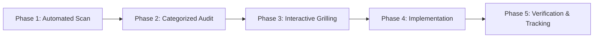

# Universal i18n Page Audit Skill

A systematic, production-ready framework to audit, translate, validate, and verify localization on any page or component tree in a web application.

---

## Capabilities & Tooling

The skill includes a **zero-dependency automated scanner script** located at:
`scripts/audit-page.mjs` (or run via `node <path-to-skill>/scripts/audit-page.mjs`).

### Scanner CLI Options
```bash
# Audit a specific page and all its imported component dependencies
node scripts/audit-page.mjs --page src/pages/DashboardPage.tsx

# Output formatted Markdown report
node scripts/audit-page.mjs --page src/pages/DashboardPage.tsx --markdown

# Output machine-readable JSON
node scripts/audit-page.mjs --page src/pages/DashboardPage.tsx --json

# Specify custom locale directory or target language
node scripts/audit-page.mjs --page src/pages/FinancePage.tsx --locale-dir src/locales --source-lang en --target-lang ar
```

---

## 5-Phase Audit Workflow



### Phase 1 — Automated Scan & Component Traversal
1. Identify the target page (e.g. `src/pages/<Page>Page.tsx`).
2. Run `node scripts/audit-page.mjs --page <path>` to traverse the full imported JSX/TSX component tree.
3. Locate relevant locale JSON files for source (e.g. `en`) and target (e.g. `ar`) languages.
4. Extract all namespaces actively used in the tree via `useTranslation('namespace')`.

### Phase 2 — Categorized Audit Findings
Collect and categorize findings across 5 core areas:

1. **🔴 Hardcoded Strings**:
   - JSX text nodes (`>Some text<`)
   - Element props: `placeholder=`, `title=`, `aria-label=`, `alt=`, `label=`, `helperText=`
   - Hardcoded arrays (day names, month names, status option lists)

2. **🟡 Missing Translation Keys**:
   - Keys invoked in code via `t('key')` but absent from source or target JSON files
   - Asymmetric keys (present in source JSON but missing in target JSON)

3. **🟣 Interpolation Mismatches**:
   - Variables like `{{count}}` or `{{name}}` present in source but missing or misspelled in target translations

4. **🔵 Directional (BiDi / RTL) Layout Issues**:
   - Physical CSS classes that break in RTL (`ml-`, `mr-`, `pl-`, `pr-`, `left-`, `right-`, `text-left`, `text-right`)
   - Replace with Tailwind logical properties:
     - `ml-*` → `ms-*` (margin-inline-start)
     - `mr-*` → `me-*` (margin-inline-end)
     - `pl-*` → `ps-*` (padding-inline-start)
     - `pr-*` → `pe-*` (padding-inline-end)
     - `left-*` → `start-*`
     - `right-*` → `end-*`
     - `text-left` → `text-start`
     - `text-right` → `text-end`

5. **🟢 Directional Navigation Icons**:
   - Icons conveying forward/backward direction (`arrow_forward`, `chevron_right`, `arrow_back`, `navigate_next`)
   - Ensure they have `.icon-flip-rtl` or `rtl:rotate-180` / `rtl:scale-x-[-1]` applied

---

### Phase 3 — Interactive Grilling (Translation Validation)

For any translation that meets any of the following criteria, present options and align with the user via `ask_question`:

| Condition | Why Review is Required | Example |
|-----------|------------------------|---------|
| **Ambiguous / Polysemous** | Word has multiple valid meanings | "Balance" → رصيد vs توازن |
| **Register / Dialect Conflict** | Formal (MSA) vs Colloquial | "Create payment" → إنشاء فاتورة vs فاتورة جديدة |
| **Length / UI Fit** | Target text may truncate on mobile | Mobile empty state: "مفيش مجموعات" vs desktop "مفيش مجموعات النهاردة" |
| **Technical / Brand Terms** | Should remain untranslated or transliterated | "TechnoTerminal", "TBA" → يتحدد بعدين |
| **Button vs Heading Style** | Verbs vs Noun phrases | "Quick Register" → سجّل طالب (verb) vs تسجيل  (noun) |

#### Question Batching Rule
- Group questions by similarity (max 3–4 questions per interactive modal).
- Always include the recommended option first, prefixed with `(Recommended)`.
- Provide write-in option by default.

---

### Phase 4 — Implementation & Code Wiring

Follow strict dependency order:
1. **Update Source Locale JSON** (e.g. `src/locales/en/<ns>.json`): add any new keys first.
2. **Update Target Locale JSON** (e.g. `src/locales/<target>/<ns>.json`): add approved translations and fix mismatches.
3. **Wire Components**:
   - Add `useTranslation('<namespace>')` to unwired components.
   - Replace raw text and props with `t('key')` or `t('key', { variable })`.
   - Update physical CSS classes to logical properties (`ms-`, `me-`, `ps-`, `pe-`, `start-`, `end-`).
   - Add directional flip classes to navigation icons.
4. **Compile & Typecheck**:
   - Run `npx tsc -b` or project build command. Must exit `0`.

---

### Phase 5 — Verification & Central Tracking

1. Write or update the feature spec at `specs/0<NNN>-<page-name>-i18n-audit/plan.md`.
2. Update the central progress tracker at `docs/i18n-audit-tracker.md`.

---

## Universal Formatting Standards

### 1. Dates and Times
Always use locale-aware formatters bound to the active runtime language:
```ts
// Prefer:
date.toLocaleDateString(i18n.language, options)
// Or Intl formatters:
new Intl.DateTimeFormat(i18n.language, { dateStyle: 'medium' }).format(date)
```

### 2. Numbers and Currencies
- Use Latin standard digits (`1, 2, 3`) in web terminals and data tables for universal clarity.
- Currency formatting should adapt symbol position to locale (e.g. `150 EGP` or `150 ج.م`).

### 3. Pluralization (i18next CLDR Standard)
For languages with complex plural rules (such as Arabic 6-form plurals: `zero`, `one`, `two`, `few`, `many`, `other`):
```json
{
  "student_count_zero": "لا يوجد طلاب",
  "student_count_one": "طالب واحد",
  "student_count_two": "طالبان",
  "student_count_few": "{{count}} طلاب",
  "student_count_many": "{{count}} طالباً",
  "student_count_other": "{{count}} طالب"
}
```

---

## Central Audit Tracker Template

Maintain a centralized status table at `docs/i18n-audit-tracker.md`:

```markdown
# Application Localization Audit Tracker

| # | Page / Route | Namespace(s) | Status | Hardcoded Fixed | Spec Plan |
|---|--------------|--------------|--------|-----------------|-----------|
| 01 | Dashboard | `dashboard` | ✅ Completed | 33 strings | [Spec 072](specs/072-dashboard-i18n-audit/plan.md) |
| 02 | Groups | `groups` | ⏳ Pending | — | — |
| 03 | Group Detail | `groups`, `attendance` | ⏳ Pending | — | — |
| 04 | Directory | `directory` | ⏳ Pending | — | — |
| 05 | Student Detail | `directory`, `common` | ⏳ Pending | — | — |
| 06 | Parent Detail | `directory`, `common` | ⏳ Pending | — | — |
| 07 | Enrollments | `enrollments` | ⏳ Pending | — | — |
| 08 | Finance | `finance` | ⏳ Pending | — | — |
...
```
