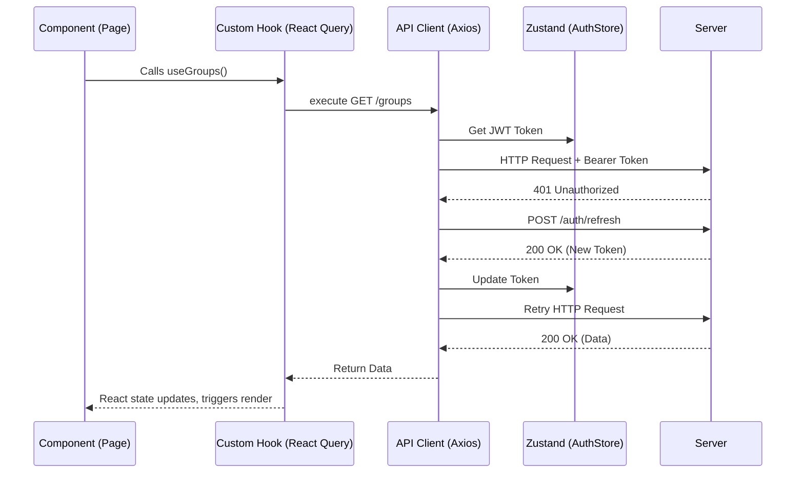

# Techno Terminal UI - Architecture Context Document

## 1. High-Level Overview
Techno Terminal UI is a modern, single-page application (SPA) built to manage an educational/CRM system. 

**Technology Stack:**
- **Framework:** React 19 + Vite
- **Language:** TypeScript
- **Routing:** React Router DOM v7
- **State Management:** Zustand (Global State) + React Query (Server State)
- **API Client:** Axios
- **Styling:** TailwindCSS (v3.4) + Custom CSS Variables
- **Icons:** Lucide React & Google Material Symbols

---

## 2. Directory & Module Organization
The `src/` directory follows a feature-driven, domain-separated pattern combined with technical layering:

- **`api/`**: Centralized Axios client and domain-specific endpoints (e.g., `auth`, `crm`, `finance`).
- **`components/`**:
  - `common/`: Reusable UI elements (Modals, Tables, Forms, Pagination).
  - `layout/`: App shell components (`AppLayout`, `Sidebar`).
  - `[domain]/`: Feature-specific components (e.g., `students`, `finance`, `courses`).
- **`hooks/`**: Custom React Query hooks mapping to domain logic. Contains highly reusable data-fetching and pagination hooks.
- **`pages/`**: Top-level route components. They act as containers that fetch data via hooks and pass it to components.
- **`store/`**: Global state using Zustand (e.g., `authStore.ts`).
- **`utils/`**: Helper functions, constants (e.g., `colors.ts`), and formatting utilities.
- **`types/`**: Global TypeScript interfaces.

---

## 3. Data Flow & State Management

The application strictly separates **Global UI State** from **Server State**.

### Global UI State (Zustand)
Used for state that must be accessed synchronously across the app without triggering unnecessary re-renders. 
- Example: `authStore` manages the JWT token, refresh token, user profile, and `isAuthenticated` flag.

### Server State (React Query)
Used for all asynchronous API calls, providing out-of-the-box caching, pagination, and invalidation.

---

## 4. Component Hierarchy and Routing

### Routing Architecture
Client-side routing is handled by `react-router-dom` in `src/App.tsx`.
- **Public Routes:** Accessible only when logged out (e.g., `/login`).
- **Protected Routes:** Wrapped in `<ProtectedRoute />` and `<AppLayout />`. Includes pages like `/dashboard`, `/groups`, `/directory`.
- **Role-Based Routes:** `<RoleBasedRoute allowedRoles={['admin', 'system_admin']} />` protects sensitive endpoints like `/notifications`.

### Component Anatomy
A typical Page component (`src/pages/[Entity]Page.tsx`) follows this structure:
1. **Hook Initialization:** Calls domain hooks (e.g., `usePaginatedList`) to fetch and manage server state.
2. **Layout Wrap:** Returns `
` containing `<PageHeader>`.
3. **Controls:** Renders `<SearchBar>` and filtering pills.
4. **Data Display:** Uses generic components like `<DataTableContainer>` or grids of `<EntityCard>`.
5. **Pagination:** Plugs state into `<Pagination>` components.

---

## 5. Coding Standards & Implementation Patterns

### Reusable Hook Pattern
The project heavily leverages generic hooks for repeated UI behaviors. A prime example is `usePaginatedList.ts`:
- **Purpose:** Handles client-side pagination, sorting (asc/desc), and text-based searching over an array of objects.
- **Usage:** Components pass raw data and config, receiving sliced `paginatedItems` and `handleSort` actions.

### API Interceptor Pattern
The Axios instance in `src/api/client.ts` implements a robust interceptor pattern:
- **Request Interceptor:** Automatically injects the JWT token from `authStore`.
- **Response Interceptor:** Catches `401 Unauthorized` errors. It queues concurrent requests, calls the `/auth/refresh` endpoint, updates the `authStore`, and replays the queued requests seamlessly.

### Styling & Design System
- **TailwindCSS:** Used for all utility-based styling.
- **Color System:** Centralized color palettes in `tailwind.config.js` (`primary`, `surface`, `error`) aligned with Material Design 3 surface tones.
- **Status Colors:** `src/utils/colors.ts` defines consistent badge/pill colors for entity statuses (e.g., `attendanceStatusColors`, `paymentStatusColors`).

---
