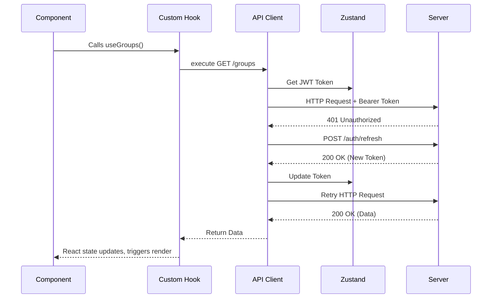

# Techno Terminal UI — Architecture

## 1. High-Level Overview

Techno Terminal UI is a single-page CRM for managing an educational center. It handles groups, students, enrollments, finance, attendance, competitions, reporting, and staff.

### Technology Stack

| Layer | Choice |
|-------|--------|
| Framework | React 19 + Vite 8 |
| Language | TypeScript (strict — `noUnusedLocals`, `noUnusedParameters`, `verbatimModuleSyntax`, `erasableSyntaxOnly`) |
| Routing | React Router DOM v7 |
| Server State | TanStack React Query 5 (`staleTime: 5min`, `gcTime: 30min`, `retry: 1`) |
| Global State | Zustand 5 (persist middleware, cross-tab sync via `storage` event) |
| API Client | Axios (base `/api/v1`, JWT Bearer, 401 auto-refresh with request queuing) |
| Styling | Tailwind CSS v3.4 (v3 config, v3 plugin despite `@tailwindcss/postcss` v4 in package.json) |
| Icons | Lucide React components + Google Material Symbols (`material-symbols-outlined` CSS class) |
| Fonts | Inter (`font-body`), Space Grotesk (`font-headline`) — loaded from `index.html` via Google Fonts |
| Testing | Vitest 4 + happy-dom + `@testing-library/jest-dom` (globals enabled) |
| Linting | ESLint flat config (`eslint.config.js`) |

---

## 2. Directory & Module Organization

```
src/
├── api/
│   ├── client.ts              # Axios instance + interceptors
│   ├── {domain}/              # Domain API functions (academics/, crm/, finance/, etc.)
│   └── ...
├── components/
│   ├── common/                 # Reusable UI (Modal, DataTable, Pagination, Toast, LoadingSpinner, etc.)
│   ├── common/datatable/       # DataTable sub-components
│   ├── common/combobox/        # Combobox inputs
│   ├── layout/                 # App shell (AppLayout, Sidebar)
│   └── {domain}/               # Feature-specific components (groups/, finance/, crm/, etc.)
├── hooks/
│   ├── queryKeys.ts            # Centralized React Query key factories
│   ├── usePaginatedList.ts     # Reusable pagination hook
│   ├── usePagination.ts        # Client-side pagination
│   ├── useSearch.ts            # Debounced search
│   ├── useDebounce.ts          # Debounce utility
│   └── use{Feature}.ts        # Domain hooks
├── pages/                      # Route-level components
├── store/
│   ├── authStore.ts            # Zustand auth (persist key: `auth-storage`)
│   └── ...
├── types/                      # Shared TypeScript interfaces
├── utils/
│   ├── formatting.ts           # Time/date formatting (12h via `formatTime`)
│   ├── date.ts                 # Date utilities
│   └── colors.ts               # Status color maps
├── test/
│   └── setup.ts                # Vitest setup (loads jest-dom matchers)
└── tests/                      # Test files (*.test.{ts,tsx})
```

### Component Naming Convention

| Suffix | Directory | Example |
|--------|-----------|---------|
| `*Page.tsx` | `pages/` | `GroupsPage.tsx` |
| `*Tab.tsx` | `components/{domain}/` | `AttendanceTab.tsx` |
| `*Modal.tsx` | `components/{domain}/` | `GroupForm.tsx` |
| `*Form.tsx` | `components/{domain}/` | `GroupForm.tsx` |
| `*Table.tsx` | `components/{domain}/` | — |
| `*Card.tsx` | `components/{domain}/` | `GroupCard.tsx` |
| `*Badge.tsx` | `components/{domain}/shared/` | `GroupStatusBadge.tsx` |
| Shared/common | `components/common/` | `Pagination.tsx` |

### Data Flow

```
Page → custom hook (React Query) → API fn (Axios) → server → cache → render
```

---

## 3. Data Flow & State Management

The app strictly separates **Global UI State** from **Server State**.

### Global UI State (Zustand)

Reserved for state that must be accessed synchronously across the app.

- **`authStore`**: JWT token, refresh token, user profile, `isAuthenticated` flag. Persisted to localStorage via Zustand persist middleware. Cross-tab sync via `storage` event listener.
- No other Zustand stores — all other state is either React Query or local `useState`.

### Server State (React Query)

All asynchronous API data goes through React Query. Never use raw `fetch()`, `useEffect` for data fetching, or Axios outside the API layer.

- **`staleTime`**: 5 minutes (default), `gcTime`: 30 minutes, `retry`: 1, `refetchOnWindowFocus`: false
- **Mutations**: `retry: 0`. Always invalidate affected cache keys via `queryClient.invalidateQueries()`.
- **Query keys**: Factory functions in `src/hooks/queryKeys.ts` — never inline string arrays.

### API Layer

- **Client**: `src/api/client.ts` — Axios instance, base URL `/api/v1`
- **Request interceptor**: Injects `Bearer` token from `authStore`
- **Response interceptor**: Catches 401 → queues concurrent requests → `POST /auth/refresh` → retries queue → falls back to logout + redirect to `/login`
- **Auth-skipped endpoints**: `/auth/login`, `/auth/refresh` (don't need Bearer token)
- **Debug mode**: `localStorage.setItem('api_debug', 'true')` logs all requests; auto-enabled in DEV

### Auth Flow



---

## 4. Routing & Route Protection

Client-side routing is in `src/App.tsx` with guard components that wait for Zustand persist rehydration before deciding auth state.

| Guard | Access | Routes |
|-------|--------|--------|
| `<PublicRoute />` | Unauthenticated only | `/login`, `/register`, `/forgot-password`, `/reset-password` |
| `<ProtectedRoute />` | Authenticated | `/dashboard`, `/courses`, `/groups`, `/students`, `/attendance`, etc. |
| `<InstructorBlockedRoute />` | Block instructors | `/directory`, `/enrollments`, `/finance`, `/reports`, `/staff`, `/settings` |
| `<RoleBasedRoute allowedRoles={['admin','system_admin']} />` | Admin only | `/notifications` |

### Component Anatomy

A typical Page follows:
1. **Hook calls** — domain hooks fetch server state
2. **Layout** — wraps in page-level container
3. **Controls** — search bar, filters, view toggles
4. **Display** — DataTable, card grids, or grouped views
5. **Pagination** — `<Pagination>` component with page size selector

---

## 5. Coding Standards & Implementation Patterns

### TypeScript Constraints

- `verbatimModuleSyntax` — must `import type` for type-only imports
- `erasableSyntaxOnly: true` — no enums, namespaces, or parameter properties; use const objects or union types
- `noUncheckedSideEffectImports: true`
- `any` is forbidden unless explicitly justified in a comment
- Test files excluded from `tsc -b` via `tsconfig.app.json`

### API Module Pattern

Each domain has a barrel `index.ts` that re-exports from sub-modules:
```
src/api/academics/groups/
├── core.ts         # CRUD + list functions
├── index.ts        # barrel re-exports
├── lifecycle.ts    # level/session/lifecycle endpoints
├── newEndpoints.ts # v2 endpoints
├── competitions.ts # competition-specific endpoints
└── utils.ts        # helper functions
```

### Reusable Hook Pattern

- `usePaginatedList`: Server-side pagination, sorting, searching over an array
- `usePagination`: Simple client-side pagination math
- `useSearch`: Debounced text search (configurable `minLength`, `delay`)
- `useDebounce`: Generic debounce hook

### API Interceptor Pattern

The Axios interceptor in `src/api/client.ts`:
- **Request**: reads token from `authStore.getState().token`, injects `Authorization: Bearer <token>` header
- **Response**: on 401, queues the failed request, attempts `/auth/refresh`, if refresh succeeds => replays all queued requests with new token, if refresh fails => clears auth store and redirects to `/login`

### Styling & Design System

- **Tailwind**: Utility-first. Custom theme extends in `tailwind.config.js` (`primary`, `secondary`, `surface`, `error`).
- **Color system**: Material Design 3 surface tones — `bg-surface`, `bg-surface-container-low`, `text-on-surface`, `text-on-surface-variant`.
- **Status colors**: Centralized maps in `src/utils/colors.ts` (attendance, payment, group statuses).
- **Time formatting**: `formatTime` in `src/utils/formatting.ts` — 12-hour format.

### Build & Lint Gates

Before commits, these must pass:
1. `npm run lint` — zero ESLint errors
2. `npm run build` — `tsc -b && vite build` succeeds

---

## 6. Conventions & Constraints (Constitution)

The project follows a written constitution (`.specify/memory/constitution.md`) that codifies:

1. **Frontend-only scope** — all code lives in `src/`, no backend work
2. **Server state discipline** — React Query for all API data, never raw fetches
3. **Global state minimalism** — Zustand only for auth + truly cross-cutting state
4. **TypeScript strict mode** — the flags above are enforced by the build
5. **Component naming** — suffix-based convention (Page, Tab, Modal, etc.)
6. **Cache & API discipline** — query key factories, cross-domain invalidation

---

## 7. Deployment

- **Platform**: Vercel SPA
- **Config**: `vercel.json` — `/api/*` rewritten to FastAPI backend, all other routes to `/index.html`
- **Build**: `npm run build` outputs to `dist/`
