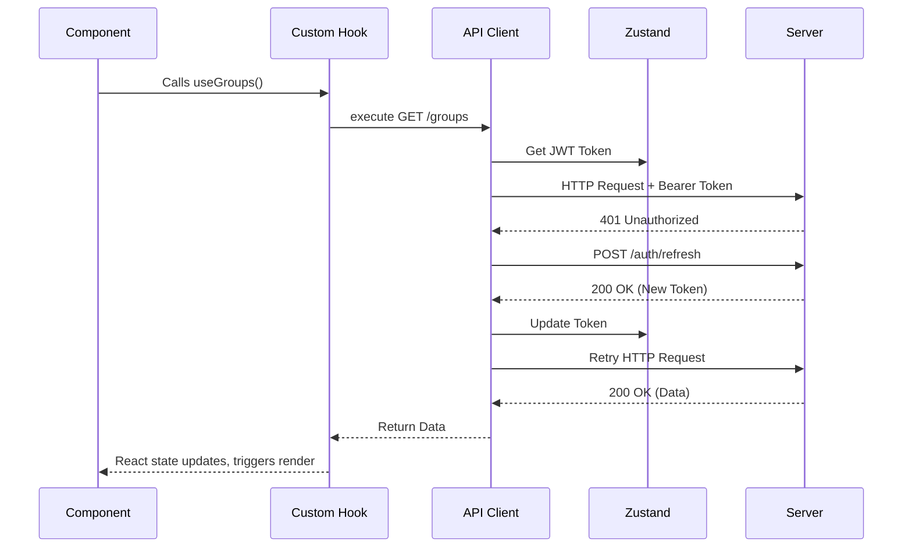

# Techno Terminal UI — Architecture

## 1. High-Level Overview

Techno Terminal UI is a single-page CRM for managing an educational center. It handles groups, students, enrollments, finance, attendance, competitions, reporting, staff, tasks, and certificates.

### Technology Stack

| Layer | Choice |
|-------|--------|
| Framework | React 19 + Vite 8 |
| Language | TypeScript (strict — `noUnusedLocals`, `noUnusedParameters`, `verbatimModuleSyntax`, `erasableSyntaxOnly`) |
| Routing | React Router DOM v7 |
| Server State | TanStack React Query 5 (`staleTime: 5min`, `gcTime: 30min`, `retry: 1`) |
| Global State | Zustand 5 (persist middleware, cross-tab sync via `storage` event) |
| API Client | Axios (base `/api/v1`, JWT Bearer, 401 auto-refresh with request queuing) |
| Styling | Tailwind CSS v3.4 (v3 config, v3 plugin despite `@tailwindcss/postcss` v4 in package.json) |
| Icons | Lucide React components + Google Material Symbols (`material-symbols-outlined` CSS class) |
| Fonts | Inter (`font-body`), Space Grotesk (`font-headline`) — loaded from `index.html` via Google Fonts |
| Charts | recharts (AreaChart for revenue, PieChart for student progress) |
| i18n | i18next + react-i18next + i18next-browser-languagedetector (English, Arabic) |
| Analytics | @vercel/speed-insights |
| Testing | Vitest 4 + happy-dom + `@testing-library/jest-dom` (globals enabled) |
| Linting | ESLint flat config (`eslint.config.js`) |

---

## 2. Directory & Module Organization

```
src/
├── api/
│   ├── client.ts              # Shared Axios instance + interceptors
│   ├── academics/             # Courses, Groups, Sessions (nested barrel pattern)
│   ├── analytics/             # Academic, BI, Competition, Financial analytics
│   ├── attendance/            # markAttendance() — POST /attendance/session/{id}/mark
│   ├── auth/                  # Login, refresh, admin (users, audit logs)
│   ├── certificates/          # SEPARATE backend (certsClient — no Bearer, no refresh)
│   ├── competitions/          # Competition CRUD
│   ├── crm/                   # Parents, Students (core, search, payments, history, siblings, enrollments)
│   ├── dashboard/             # Overview, schedule, sessions
│   ├── enrollments/           # Enrollment CRUD
│   ├── finance/               # Balance, receipts, refunds, competition fees, reporting
│   ├── hr/                    # Employees, staff accounts
│   ├── notifications/         # Admin settings, notification logs
│   ├── reports/               # Daily, monthly, weekly (no barrel index.ts)
│   ├── tasks/                 # Task CRUD
│   └── teams/                 # Team CRUD
├── assets/                    # Static assets (capabilities.md, hero.png, etc.)
├── components/
│   ├── attendance/            # 12-file attendance grid system
│   ├── auth/                  # AuthLayout
│   ├── certificates/          # CertificateCard, CertificateForm, CertificateDetailModal
│   ├── common/                # 40+ reusable UI primitives
│   │   ├── __tests__/         # DataTable.test.tsx
│   │   ├── cards/             # ContactCard, EntityDetailCard, MetricSummaryCard, etc.
│   │   ├── combobox/          # Combobox input
│   │   ├── datatable/         # DataTable, FlatTable, GroupedTable, SortIndicator, etc.
│   │   ├── dialogs/           # EntitySelectionDialog, ItemDetailDialog
│   │   ├── layout/            # EntityPageHeader
│   │   └── lists/             # RelatedEntityList
│   ├── competitions/          # CompetitionCard, TeamsTab, TeamRegistrationModal, etc.
│   ├── courses/               # CourseCard, CourseForm, CoursesTable, etc.
│   ├── crm/                   # StudentForm, ParentForm, WaitingListPanel, etc.
│   ├── dashboard/             # DaySelectorBar, StatWidget, TopNavbar, MobileGroupCard, etc.
│   ├── directory/             # CardGrid, StudentCard, ParentCard, AdvancedSearchPanel
│   ├── enrollments/           # EnrollPanel, DropEnrollmentPanel, EditEnrollmentModal
│   ├── finance/               # CreateReceiptPanel, ReceiptDetailPanel, SlideToConfirm, etc.
│   ├── groups/                # GroupForm, GroupCard, LevelsTab, HistoryTab, detail/
│   ├── layout/                # AppLayout, Sidebar, BottomNav, MobileNavSheet, MobileTopBar
│   ├── notifications/         # AdminSettingsTab, BulkMessagingTab, LogsTab
│   ├── reports/               # Atomic design: atoms/, molecules/, organisms/, hooks/
│   ├── settings/              # ProfileTab, UsersTab, AuditLogTable, LanguageSettings
│   ├── staff/                 # EmployeeForm, EmployeeCard, CreateAccountModal
│   ├── student/               # OverviewTab, PaymentsTab, EnrollmentsTab, etc.
│   ├── tasks/                 # TaskListTable, TaskDetailDrawer, CreateTaskModal, etc.
│   └── teams/                 # TeamEditModal
├── config/                    # studentGrouping.ts (DEFAULT_AGE_BUCKETS)
├── constants/                 # auditLabels.ts
├── hooks/
│   ├── queryKeys.ts           # Centralized React Query key factories (146 lines)
│   ├── usePaginatedList.ts    # Server-side pagination hook
│   ├── usePagination.ts       # Client-side pagination
│   ├── useSearch.ts           # Debounced search
│   ├── useDebounce.ts         # Generic debounce
│   ├── useIsMobile.ts         # Breakpoint hook (max-width: 1023px)
│   ├── useClickOutside.ts     # Click outside detection
│   ├── useNavDirection.ts     # Navigation direction tracking
│   ├── useDropdownPosition.ts # Dropdown positioning
│   └── use{Feature}.ts       # ~25 domain-specific hooks
│   ├── competitions/          # useCompetition, useCompetitions, etc.
│   ├── dashboard/             # useDashboard
│   ├── directory/             # useDirectoryData, useAdvancedSearch
│   ├── finance/               # useBalance, useReceipts, useRefunds, etc.
│   ├── notifications/         # useNotificationLogs, useAdminSettings
│   ├── students/              # useStudentDetail, useStudentPayments, etc.
│   └── teams/                 # useTeams, useTeamMembers, etc.
├── i18n/                      # i18next initialization (index.ts)
├── lib/                       # queryClient.ts (React Query defaults)
├── locales/
│   ├── en/                    # 14 namespace JSON files
│   └── ar/                    # 14 namespace JSON files (mirrored)
├── pages/                     # 25 route-level page components (all lazy-loaded)
├── store/
│   ├── authStore.ts           # JWT, user, isAuthenticated (persist: auth-storage)
│   ├── settingsStore.ts       # Locale, direction (persist: settings-storage)
│   └── groupingSettingsStore.ts # Age buckets (persist: grouping-settings-storage)
├── types/
│   ├── api.ts                 # ApiResponse<T>, PaginatedApiResponse<T>
│   └── pagination.ts          # PaginationParams
├── utils/
│   ├── apiErrors.ts           # API error handling
│   ├── attendanceTransforms.ts# Bridges new API DTOs → dashboard DTOs
│   ├── categorySelection.ts   # Competition category helpers
│   ├── colors.ts              # Status color maps
│   ├── date.ts                # Date utilities
│   ├── dayTranslation.ts      # Day name translation
│   ├── egyptianValidators.ts  # Egyptian phone/national-ID validators
│   ├── formatting.ts          # formatTime (12h), other formatting
│   ├── recentCache.ts         # Recent items cache
│   └── scheduleTransform.ts   # Schedule data transformation
├── test/
│   └── setup.ts               # Vitest setup (jest-dom matchers)
└── tests/                     # 15 test files
    ├── auth/                  # authApi, authStore, client, LoginPage, RoleBasedRoute
    └── *.test.tsx             # CategoryTeamsModal, CertificateCard, CompetitionDetailPage, etc.
```

### Component Naming Convention

| Suffix | Directory | Example |
|--------|-----------|---------|
| `*Page.tsx` | `pages/` | `GroupsPage.tsx` |
| `*Tab.tsx` | `components/{domain}/` | `LevelsTab.tsx` |
| `*Modal.tsx` | `components/{domain}/` | `GroupForm.tsx` |
| `*Form.tsx` | `components/{domain}/` | `GroupForm.tsx` |
| `*Card.tsx` | `components/{domain}/` | `GroupCard.tsx` |
| `*Badge.tsx` | `components/{domain}/shared/` | `GroupStatusBadge.tsx` |
| Shared/common | `components/common/` | `Pagination.tsx` |

### Data Flow

```
Page → custom hook (React Query) → API fn (Axios) → server → cache → render
```

---

## 3. Data Flow & State Management

The app strictly separates **Global UI State** from **Server State**.

### Global UI State (Zustand)

Three stores, all with `persist` middleware and cross-tab sync via `storage` event:

| Store | Persist Key | Purpose |
|-------|-------------|---------|
| `authStore` | `auth-storage` | JWT token, refresh token, user profile, `isAuthenticated` flag |
| `settingsStore` | `settings-storage` | Locale (`en`/`ar`), direction (`ltr`/`rtl`) |
| `groupingSettingsStore` | `grouping-settings-storage` | Age buckets for student grouping |

### Server State (React Query)

All asynchronous API data goes through React Query. Never use raw `fetch()`, `useEffect` for data fetching, or Axios outside the API layer.

- **`staleTime`**: 5 minutes (default), `gcTime`: 30 minutes, `retry`: 1, `refetchOnWindowFocus`: false
- **Mutations**: `retry: 0`. Always invalidate affected cache keys via `queryClient.invalidateQueries()`.
- **Query keys**: Factory functions in `src/hooks/queryKeys.ts` — never inline string arrays.

### API Layer — Two Backends

#### Main API (`src/api/client.ts`)

- **Client**: Axios instance, base URL `/api/v1`
- **Request interceptor**: Injects `Bearer` token from `authStore`
- **Response interceptor**: Catches 401 → queues concurrent requests → `POST /auth/refresh` → retries queue → falls back to logout + redirect to `/login`
- **Auth-skipped endpoints**: `/auth/login`, `/auth/refresh`, `/auth/reset-password-confirm`
- **Debug mode**: `localStorage.setItem('api_debug', 'true')` logs all requests; auto-enabled in DEV

#### Certificates API (`src/api/certificates/certificates.ts`)

- **Separate backend**: `techno-future-certs.fastapicloud.dev`
- **Client**: Own `certsClient` Axios instance — no Bearer injection, no refresh queue
- **DEV proxy**: `/certs-api` → target backend (Vite proxy strips prefix)
- **PROD**: Direct URL constant in the certificates module

### Auth Flow



---

## 4. Routing & Route Protection

Client-side routing is in `src/App.tsx` with guard components that wait for Zustand persist rehydration before deciding auth state. All page components are **lazy-loaded** via `React.lazy()`.

| Guard | Access | Routes |
|-------|--------|--------|
| `<PublicRoute />` | Unauthenticated only | `/login`, `/register`, `/forgot-password`, `/reset-password` |
| `<ProtectedRoute />` | Authenticated | `/dashboard`, `/courses`, `/groups`, `/students/:id`, `/competitions`, `/certificates`, `/capabilities`, etc. |
| `<InstructorBlockedRoute />` | Block instructors | `/directory`, `/enrollments`, `/finance`, `/reports`, `/staff`, `/tasks`, `/settings` |
| `<RoleBasedRoute allowedRoles={['admin','system_admin']} />` | Admin only | `/notifications` |

### Full Route Table

| Path | Component | Guard |
|------|-----------|-------|
| `/` | Redirect → `/dashboard` | — |
| `/login` | `LoginPage` | Public |
| `/register` | `RegisterPage` | Public |
| `/forgot-password` | `ForgotPasswordPage` | Public |
| `/reset-password` | `ResetPasswordPage` | Public |
| `/dashboard` | `DashboardPage` | Protected |
| `/courses` | `CoursesPage` | Protected |
| `/courses/:id` | `CourseDetailPage` | Protected |
| `/groups` | `GroupsPage` | Protected |
| `/groups/:id` | `GroupDetailPage` | Protected |
| `/students/:id` | `StudentDetailPage` | Protected |
| `/parents/:id` | `ParentDetailPage` | Protected |
| `/attendance` | Placeholder `<div>` | Protected |
| `/capabilities` | `CapabilitiesPage` | Protected |
| `/competitions` | `CompetitionsPage` | Protected |
| `/competitions/:id` | `CompetitionDetailPage` | Protected |
| `/competitions/:id/edit` | `CompetitionEditPage` | Protected |
| `/teams/:id` | `TeamDetailPage` | Protected |
| `/certificates` | `CertificatesPage` | Protected |
| `/directory` | `DirectoryPage` | Instructor-blocked |
| `/enrollments` | `EnrollmentsPage` | Instructor-blocked |
| `/finance` | `FinancePage` | Instructor-blocked |
| `/reports` | `ReportsPage` | Instructor-blocked |
| `/staff` | `StaffPage` | Instructor-blocked |
| `/tasks` | `TasksPage` | Instructor-blocked |
| `/settings` | `SettingsPage` | Instructor-blocked |
| `/notifications` | `NotificationsPage` | Admin-only |
| `*` | Redirect → `/login` | — |

### Component Anatomy

A typical Page follows:
1. **Hook calls** — domain hooks fetch server state
2. **Layout** — wraps in page-level container
3. **Controls** — search bar, filters, view toggles
4. **Display** — DataTable, card grids, or grouped views
5. **Pagination** — `<Pagination>` component with page size selector

---

## 5. Internationalization (i18n)

### Setup

- **Library**: i18next + react-i18next + i18next-browser-languagedetector
- **Config**: `src/i18n/index.ts`
- **Languages**: English (`en`, default/fallback) and Arabic (`ar`)
- **Detection order**: `localStorage` → `navigator`
- **Direction**: Set via `settingsStore` (`ltr`/`rtl`), applied in `App.tsx` via `useEffect`

### Namespaces (14)

| Namespace | Coverage |
|-----------|----------|
| `common` | Shared labels, buttons, actions |
| `layout` | Sidebar, navigation |
| `dashboard` | Dashboard widgets |
| `groups` | Group management |
| `attendance` | Attendance grid |
| `directory` | Student/parent directory |
| `staff` | Employee management |
| `reports` | Report tabs and labels |
| `competitions` | Competition management |
| `enrollments` | Enrollment operations |
| `finance` | Receipts, payments |
| `notifications` | Notification admin |
| `tasks` | Task management |
| `courses` | Course management |

### Locale Files

Identical structure in `src/locales/en/` and `src/locales/ar/` — 14 JSON files each (28 total).

---

## 6. Mobile Layout & Navigation

### Breakpoint

`useIsMobile` hook: `(max-width: 1023px)` — the `lg` Tailwind breakpoint.

### Mobile Components

| Component | Purpose |
|-----------|---------|
| `BottomNav.tsx` | Fixed bottom navigation bar |
| `MobileNavSheet.tsx` | Bottom sheet for "More" menu items |
| `MobileTopBar.tsx` | Sticky top bar for mobile pages |
| `MobileDashboardFAB.tsx` | Floating action button on dashboard |
| `MobileGroupCard.tsx` | Mobile-optimized group card |
| `StudentMobileCard.tsx` | Mobile student card |
| `ParentMobileCard.tsx` | Mobile parent card |
| `AttendanceMobileSheet.tsx` | Two-step attendance flow (session picker → student list) |

### Mobile Sheet Pattern

Bottom sheets use `z-[60]` (above BottomNav `z-50`) with a `fixed inset-0 bg-black/60 z-[60]` backdrop. Dismiss on backdrop click, Escape key, or close button.

---

## 7. Attendance Grid System

A 12-component system for marking and saving student attendance per session.

```
src/components/attendance/
├── AttendanceGrid.tsx          # Main container — orchestrates all state
├── AttendanceHeader.tsx        # Session column headers (date, time, instructor)
├── AttendanceTableBody.tsx     # Student rows × session columns grid
├── AttendanceCell.tsx          # Click-to-toggle cell (not_taken → present → absent)
├── AttendanceFooter.tsx        # Save/Cancel bar with per-session retry buttons
├── AttendanceMobileSheet.tsx   # Mobile two-step flow
├── SessionActionsRow.tsx       # Edit/Cancel/Delete/Reactivate/Complete buttons
├── SessionNotesRow.tsx         # Textarea for per-session notes
├── EditSessionPopup.tsx        # Modal for editing session details
├── StudentInfo.tsx             # Student name + billing badge
├── PaymentSummaryStrip.tsx     # Paid/Due counts + remaining balance
└── types.ts                    # Local type definitions
```

### Data Flow

1. **Dashboard view**: `useDashboardOverview` provides `ScheduledGroupDTO` with roster, sessions, and embedded attendance.
2. **Group-specific view**: `useGroupAttendance` calls `GET /academics/groups/{id}/attendance?level_number=N`.
3. **Transform layer**: `src/utils/attendanceTransforms.ts` bridges the two DTO formats.

### Save Model

- **Batch save**: Toggles update local state optimistically, queued in `pendingChanges`
- "Save Changes" button triggers `handleSaveAll` — saves per-session in parallel
- Per-session status tracking: `idle | saving | success | error`
- Failed sessions show retry buttons in footer
- After save: invalidates dashboard overview + group attendance queries

---

## 8. Reports — Atomic Design

The reports module uses atomic design pattern:

```
src/components/reports/
├── atoms/                      # Small data displays
│   ├── ReportDebtorsDetails.tsx
│   ├── ReportPaymentDetails.tsx
│   ├── ReportSessionDetails.tsx
│   └── ReportSummaryCards.tsx
├── molecules/                  # Composite controls
│   ├── ReportDaySelectorBar.tsx
│   ├── ReportEmailSender.tsx
│   ├── ReportMonthSelectorBar.tsx
│   ├── ReportWeekSelectorBar.tsx
│   └── TabNavigation.tsx
├── organisms/                  # Full tab views
│   ├── DailyReportTab.tsx
│   ├── MonthlyReportTab.tsx
│   ├── ProgressTab.tsx
│   ├── RevenueAndCollectionsTab.tsx
│   └── WeeklyReportTab.tsx
├── hooks/                      # Data fetching
│   ├── useDailyReport.ts
│   ├── useWeeklyReport.ts
│   ├── useMonthlyReport.ts
│   ├── useRevenueData.ts
│   ├── useStudentProgress.ts
│   ├── useDailyCollections.ts
│   └── useReportsSummary.ts
├── RevenueChart.tsx            # recharts AreaChart
└── StudentProgressChart.tsx    # recharts PieChart
```

---

## 9. Coding Standards & Implementation Patterns

### TypeScript Constraints

- `verbatimModuleSyntax` — must `import type` for type-only imports
- `erasableSyntaxOnly: true` — no enums, namespaces, or parameter properties; use const objects or union types
- `noUncheckedSideEffectImports: true`
- `any` is forbidden unless explicitly justified in a comment
- Test files excluded from `tsc -b` via `tsconfig.app.json`

### API Module Pattern

Each domain has a barrel `index.ts` that re-exports from sub-modules:
```
src/api/academics/groups/
├── core.ts         # CRUD + list functions
├── index.ts        # barrel re-exports
├── lifecycle.ts    # level/session/lifecycle endpoints
├── newEndpoints.ts # v2 endpoints
└── utils.ts        # helper functions
```

### Reusable Hook Pattern

- `usePaginatedList`: Server-side pagination, sorting, searching over an array
- `usePagination`: Simple client-side pagination math
- `useSearch`: Debounced text search (configurable `minLength`, `delay`)
- `useDebounce`: Generic debounce hook
- `useIsMobile`: Breakpoint detection (1023px)

### Styling & Design System

- **Tailwind**: Utility-first. Custom theme extends in `tailwind.config.js` (`primary`, `secondary`, `surface`, `error`).
- **Color system**: Material Design 3 surface tones — `bg-surface`, `bg-surface-container-low`, `text-on-surface`, `text-on-surface-variant`.
- **Status colors**: Centralized maps in `src/utils/colors.ts` (attendance, payment, group statuses).
- **Time formatting**: `formatTime` in `src/utils/formatting.ts` — 12-hour format.
- **Border radius**: Non-standard values — `rounded` = `0.125rem`, `rounded-full` = `0.75rem` (not `9999px`).
- **Fonts**: Space Grotesk (`font-headline`) for headings, Inter (`font-body`) for body text.

### Build & Lint Gates

Before commits, these must pass:
1. `npm run lint` — zero ESLint errors
2. `npm run build` — `tsc -b && vite build` succeeds

---

## 10. API Domain Summary

| Domain | Files | Key Endpoints |
|--------|-------|---------------|
| `academics` | 9 files + nested dirs | Courses CRUD, Groups CRUD, Sessions CRUD, lifecycle |
| `analytics` | 6 files | Academic, BI, Competition, Financial analytics |
| `attendance` | 3 files | `markAttendance()` — POST /attendance/session/{id}/mark |
| `auth` | 4 files | Login, refresh, admin (users, audit logs, MFA) |
| `certificates` | 3 files | **Separate backend** — `certsClient` (no Bearer, no refresh) |
| `competitions` | 3 files | Competition CRUD |
| `crm` | 3 + nested `students/` (12 files) | Parents, Students (core, search, payments, history, siblings) |
| `dashboard` | 3 + `types/` | Overview, schedule, sessions |
| `enrollments` | 3 files | Enrollment CRUD |
| `finance` | 7 files | Balance, receipts, refunds, competition fees, reporting |
| `hr` | 5 files | Employees, staff accounts |
| `notifications` | 4 files | Admin settings, notification logs |
| `reports` | 3 files | Daily, monthly, weekly (no barrel index) |
| `tasks` | 3 files | Task CRUD |
| `teams` | 3 files | Team CRUD |

**Total**: 15 domain modules + shared `client.ts` = 16 API modules.

---

## 11. Conventions & Constraints (Constitution)

The project follows a written constitution (`.specify/memory/constitution.md`) that codifies:

1. **Frontend-only scope** — all code lives in `src/`, no backend work
2. **Server state discipline** — React Query for all API data, never raw fetches
3. **Global state minimalism** — Zustand only for auth + settings + grouping preferences
4. **TypeScript strict mode** — the flags above are enforced by the build
5. **Component naming** — suffix-based convention (Page, Tab, Modal, etc.)
6. **Cache & API discipline** — query key factories, cross-domain invalidation

---

## 12. Deployment

- **Platform**: Vercel SPA
- **Config**: `vercel.json`
  - `/api/*` rewritten to FastAPI backend (`techno-terminal-5c255cfe.fastapicloud.dev`)
  - All other routes → `/index.html`
- **Certificates API**: Not rewritten — prod `certsClient` hits `techno-future-certs.fastapicloud.dev` directly
- **DEV proxy**: Vite proxies `/api` → main backend, `/certs-api` → certificates backend (prefix stripped)
- **Build**: `npm run build` outputs to `dist/`
